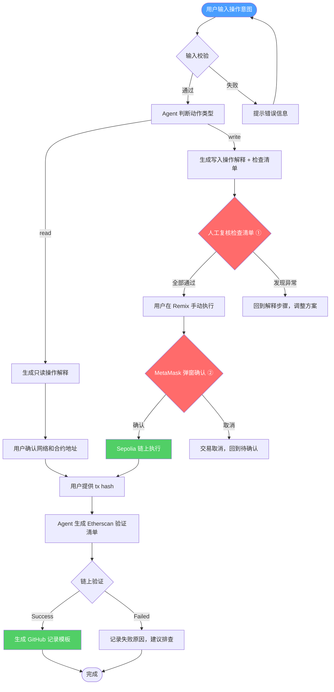

# 受限合约交互检查助手 — 设计文档

**任务来源：** Week 1｜综合进阶｜设计一个受限 Web3 助手或小 workflow
**复用材料：** Sepolia SimpleStorage 合约（`0x80ac7a484a4759ccae47f735e12997361b58658f`）、测试网交易（`0x3875...`）、AI×Web3 最小交叉流程图

---

## 一、问题背景与设计动机

### 1.1 为什么需要一个「受限」助手？

在 AI × Web3 的交叉场景中，最容易犯的错误是**让 AI 太接近执行层**——让 Agent 直接发起交易、接触私钥、自动签名。这在测试网可能是「方便」，但在主网意味着真实资产损失。

Week 1 的 Handbook 明确指出：

> AI 可以规划、解释、生成草稿、检查结果或准备交易说明，但不能自动接触私钥、助记词、API Key，也不能绕过人工确认完成签名、授权、转账或合约写入。

所以这个助手的设计核心不是「让 AI 帮你交易」，而是「让 AI 帮你**理解**你要做什么、**检查**你是否做对了、**验证**结果是否正确」。

### 1.2 设计目标

| 目标 | 说明 |
|------|------|
| 降低理解门槛 | 用户不需要完全理解 eth_call 和 eth_sendTransaction 的区别，助手会解释 |
| 减少操作失误 | 在用户点「确认」之前，提供结构化检查清单 |
| 建立验证习惯 | 引导用户用区块浏览器验证，而不是只看 UI 或 AI 的回复 |
| 明确安全边界 | 哪些步骤 AI 可以做、哪些必须人做，清清楚楚 |

### 1.3 不做什么

- 不接钱包签名
- 不自动转账/授权/写合约
- 不读取私钥/助记词/API Key
- 不对未知合约做安全判断
- 不在主网执行任何操作
- 不把 AI 输出当作链上真相

---

## 二、助手定位

| 项目 | 内容 |
|------|------|
| 名称 | 受限合约交互检查助手（Limited Web3 Contract Interaction Assistant） |
| 核心能力 | 解释操作 → 生成检查清单 → 引导人工确认 → 指导链上验证 |
| 适用对象 | AI×Web3 School 学员，已完成 Week 1 基础任务，需要一个结构化的合约交互辅助流程 |
| 安全等级 | 最小权限 — 只读 + 生成说明，不写入、不签名、不接触敏感信息 |

### 适用场景

| 场景 | 说明 | 助手能做什么 |
|------|------|-------------|
| 读取合约状态 | 调用 get() 查看 storedNumber | 解释 eth_call、生成 Etherscan 链接 |
| 写入合约状态 | 调用 set(value) 改变 storedNumber | 生成检查清单、解释签名含义、指导验证 |
| 验证已有交易 | 拿到 tx hash 后确认结果 | 生成验证清单、解释各字段含义 |
| 学习概念 | 不理解 read/write 区别 | 用大白话解释 + 类比 + 检查题 |

### 不适用场景

| 场景 | 为什么不行 |
|------|-----------|
| 主网操作 | 涉及真实资产，风险不可控 |
| ERC20 授权 | 无限授权可能导致资产被盗 |
| DeFi swap/borrow | 复杂合约交互，风险远超 SimpleStorage |
| 未知合约 | 助手无法判断合约是否安全 |
| 自动签名 | 「受限」的核心：签名权在用户手里 |

---

## 三、用户输入规范

### 3.1 输入 Schema

```yaml
operation:
  network:    "Sepolia"                    # 必填，固定为测试网
  contract:   "0x80ac7a484a4759ccae47f735e12997361b58658f"  # 必填，与已部署合约一致
  action:     "get" | "set"                # 必填
  value:      number | null                # set 时必填，正整数
  tx_hash:    "0x..." | null               # 验证时选填
```

### 3.2 输入校验规则

| 字段 | 校验规则 | 不通过时的处理 |
|------|---------|---------------|
| network | 必须是 `Sepolia` | 拒绝执行，提醒「本助手仅支持测试网操作」 |
| contract | 必须是 `0x80ac7a484a4759ccae47f735e12997361b58658f` | 拒绝执行，提醒「合约地址不匹配，请确认」 |
| action | 必须是 `get` 或 `set` | 提示可选动作 |
| value | set 时必须为正整数 | 提示「set() 需要一个数字参数」 |
| tx_hash | 必须以 `0x` 开头，长度 66 字符 | 提示交易哈希格式错误 |

### 3.3 边界条件

| 边界 | 处理方式 |
|------|---------|
| value = 0 | 允许。set(0) 是合法操作，会把 storedNumber 重置为 0 |
| value 为负数 | 拒绝。uint256 不接受负数 |
| value 超大（接近 2^256） | 提醒用户确认，虽然技术上合法但可能是误操作 |
| 用户不提供 tx_hash | 可以跳过验证步骤，只做交易前指导 |
| 用户提供错误的 tx_hash | 引导用户在 Etherscan 上查找正确的交易哈希 |

---

## 四、输出规范

### 4.1 输出类型

助手的输出分为 5 种类型：

| 输出类型 | 什么时候产生 | 内容 |
|----------|-------------|------|
| 操作解释 | 用户输入操作意图后 | 这个操作是什么、会发生什么、需要什么前提 |
| 检查清单 | 操作解释之后 | 结构化的逐项检查列表，用户逐条确认 |
| 风险提醒 | 检查清单之后 | 可能出错的地方、为什么需要人工确认 |
| 验证指导 | 用户提交 tx hash 后 | 如何在 Etherscan 验证、应该看哪些字段 |
| 记录模板 | 验证完成后 | 生成 GitHub 任务文档模板，用户确认后写入 |

### 4.2 输出格式示例 — get() 操作

```
=== 操作解释 ===
get() 是一个只读查询函数。
- 它通过 eth_call 发起，不产生交易
- 不需要 MetaMask 签名
- 不消耗 Gas
- 不会改变链上状态
- 返回值是当前 storedNumber 的值

=== 检查清单 ===
□ 1. 网络：确认 MetaMask 连接的是 Sepolia 测试网
□ 2. 合约地址：确认目标是 0x80ac7a484a4759ccae47f735e12997361b58658f
□ 3. 函数：确认调用的是 get()，不是 set()

=== 风险提醒 ===
get() 风险极低（只读操作）。但仍需确认：
- 如果 MetaMask 弹出了签名窗口，说明你可能误点了其他函数，立即取消
- get() 不应该需要签名或支付 gas

=== 后续步骤 ===
1. 在 Remix 中点击 get() 按钮
2. 观察返回值（应该是当前 storedNumber 的值）
3. 如果返回值为 0，说明合约从未被写入过
```

### 4.3 输出格式示例 — set(42) 操作

```
=== 操作解释 ===
set(42) 是一个写入操作，会改变合约的 storedNumber 状态。
- 它通过 eth_sendTransaction 发起，产生一笔交易
- 需要 MetaMask 签名（私钥授权）
- 消耗 Gas（Sepolia 测试币）
- 交易上链后不可撤销
- 执行后 storedNumber 会从当前值变为 42

=== 检查清单 ===
□ 1. 网络：MetaMask 当前网络是不是 Sepolia？（不是主网！）
□ 2. 合约地址：目标地址是不是 0x80ac7a484a4759ccae47f735e12997361b58658f？
□ 3. 函数：调用的是 set() 还是别的函数？
□ 4. 参数：输入的是不是 42？有没有多打或少打数字？
□ 5. value：交易的 ETH value 是不是 0？（SimpleStorage 的 set 不需要转 ETH）
□ 6. Gas：gas 费是否在合理范围内？（Sepolia 测试网通常几 Gwei）

=== 风险提醒 ===
⚠️ 这是一个写入操作，需要人工确认：

1. 签名 = 私钥授权 = 不可撤销
   - 一旦你在 MetaMask 点了「确认」，交易就会被广播到全网
   - 测试网无资产风险，但养成习惯很重要：主网上这一步直接涉及真金白银

2. AI 幻觉风险
   - AI 可能生成错误的合约地址或参数
   - 你看到的检查清单是「候选建议」，不是「最终命令」
   - 最终判断权在你手里

3. UI 显示 ≠ 链上真相
   - Remix 显示「成功」不代表链上真的成功
   - 必须用 Etherscan 验证

=== MetaMask 弹窗检查 ===
当你点击 set() 后，MetaMask 会弹出确认窗口。请检查：
1. to 地址：是不是 0x80ac7a484a4759ccae47f735e12997361b58658f？
2. value：是不是 0 ETH？（SimpleStorage 的 set 不需要转 ETH）
3. data：是否包含 set(uint256) 的函数选择器（0x60fe47b1）和参数（42 = 0x2a）？
4. gas：是否在合理范围内？

如果任何一项不对，立即取消交易。

=== 后续步骤 ===
1. 确认无误后，点击 MetaMask 的「确认」按钮
2. 等待交易被打包（通常几秒到几十秒）
3. 从 MetaMask 或 Etherscan 获取交易哈希
4. 把交易哈希交给助手，进行链上验证
```

---

## 五、状态机模型

助手的工作流程可以用 6 个状态和它们之间的转换来描述：

```
[待输入] → 用户输入操作意图
    ↓
[解释中] → Agent 生成操作解释 + 检查清单
    ↓
[待确认] → 用户人工复核 ← 关键安全边界
    ↓
[执行中] → 用户在 Remix/MetaMask 手动执行
    ↓
[待验证] → 用户提供 tx hash
    ↓
[已验证] → Agent 指导 Etherscan 验证 + 生成记录模板
```

### 状态转换条件

| 从 | 到 | 触发条件 | 失败处理 |
|----|-----|---------|---------|
| 待输入 → 解释中 | 用户提供有效的操作意图 | 输入校验失败 → 提示错误，留在待输入 |
| 解释中 → 待确认 | Agent 完成解释和清单生成 | — |
| 待确认 → 执行中 | 用户确认检查清单所有项 | 用户发现异常 → 回到解释中，调整方案 |
| 执行中 → 待验证 | 用户完成交易，拿到 tx hash | 交易失败 → 回到待确认，检查原因 |
| 待验证 → 已验证 | Agent 完成验证指导，用户确认结果 | 验证失败 → 记录问题，建议人工排查 |

### 关键安全边界

整个流程中有两个**不可跳过的人工确认点**：

**确认点 ①：检查清单复核**
- 时机：Agent 生成清单后、用户执行前
- 内容：网络、地址、函数、参数、gas、value
- 原则：任何一项不通过，不能进入执行阶段

**确认点 ②：MetaMask 弹窗确认**
- 时机：用户点击操作后、MetaMask 弹出签名窗口时
- 内容：to 地址、data、value、gas
- 原则：AI 绝不能替用户点击「确认」，签名权在用户手里

---

## 六、权限模型与分级策略

### 6.1 操作分级

| 级别 | 操作类型 | 助手能做什么 | 需要人工确认？ | 举例 |
|------|---------|-------------|---------------|------|
| L0 | 只读/解释 | 自动执行，无需用户确认 | ❌ | 解释 get() 的含义 |
| L1 | 生成说明 | 自动生成检查清单和提醒 | ❌ | 生成 set(42) 的检查清单 |
| L2 | 测试网写入 | 提供指导，用户手动执行 | ✅ 确认点 ① + ② | 指导 set(42) 在 Sepolia 上执行 |
| L3 | 主网写入 | 默认拒绝，提醒风险 | 🚫 不执行 | 主网转账、授权、合约写入 |
| L4 | 敏感信息 | 绝对拒绝 | 🚫 不执行 | 读取私钥、助记词、API Key |

### 6.2 分级决策流程

```
用户发起操作
  │
  ▼
是否涉及私钥/助记词/API Key？
  ├─ 是 → 🚫 绝对拒绝
  └─ 否 ↓
是否为主网操作？
  ├─ 是 → 🚫 默认拒绝，提醒风险
  └─ 否 ↓
是否为写入操作（改变链上状态）？
  ├─ 是 → ✅ 生成检查清单 + 指导执行 + 要求人工确认
  └─ 否 ↓
只读操作 → ✅ 直接解释和生成链接
```

### 6.3 触发人工确认的条件

| 条件 | 为什么需要确认 |
|------|---------------|
| 操作类型为 write | 改变链上状态，不可撤销 |
| 交易包含 value > 0 | 可能是误操作，需要确认金额 |
| 交易包含 approve/授权 | 无限授权可能导致资产被盗 |
| 交易目标不是已知合约 | 未知合约可能包含恶意逻辑 |
| 网络不是 Sepolia | 可能误操作到主网 |
| gas 异常高 | 可能是合约逻辑复杂或网络拥堵 |

---

## 七、Mermaid 流程图



---

## 八、案例演示

### 8.1 案例 1：读取当前值（get）

**用户输入：**
```
网络：Sepolia
合约：0x80ac7a484a4759ccae47f735e12997361b58658f
动作：get
```

**助手输出：**

1. **操作解释：** get() 是只读查询，通过 eth_call 发起，不产生交易，不花 gas，不改变链上状态。返回值是当前 storedNumber 的值。

2. **检查清单：**
   - □ 确认 MetaMask 连接的是 Sepolia
   - □ 确认合约地址正确

3. **操作步骤：**
   - 在 Remix 的 Deployed Contracts 区域找到合约
   - 点击 get() 按钮（不需要在 MetaMask 确认）
   - 观察返回值

4. **预期结果：**
   - 如果之前调用过 set(42)，返回值应该是 42
   - 如果从未调用过 set()，返回值应该是 0

5. **异常排查：**
   - 如果 MetaMask 弹出签名窗口 → 说明你可能误点了别的函数，立即取消
   - 如果返回值不是预期 → 检查是否调用了正确的合约

---

### 8.2 案例 2：写入新值（set）

**用户输入：**
```
网络：Sepolia
合约：0x80ac7a484a4759ccae47f735e12997361b58658f
动作：set
参数：42
```

**助手输出：**

1. **操作解释：** set(42) 是写入操作，会把 storedNumber 从当前值变为 42。需要 MetaMask 签名，消耗 Gas（测试币），交易上链后不可撤销。

2. **检查清单（6 项）：**
   - □ 网络：Sepolia？
   - □ 合约地址：0x80ac7a...658f？
   - □ 函数：set()？
   - □ 参数：42？
   - □ value：0 ETH？（set 不需要转 ETH）
   - □ Gas：合理范围？

3. **MetaMask 弹窗检查：**
   - to：0x80ac7a484a4759ccae47f735e12997361b58658f
   - data：包含 0x60fe47b1（set 的选择器）和 0x2a（42 的十六进制）
   - value：0 ETH
   - gas：几 Gwei

4. **风险提醒：** 签名 = 私钥授权 = 不可撤销。测试网无资产风险，但养成确认习惯很重要。

5. **用户确认后执行：**
   - 点击 MetaMask「确认」
   - 等待交易打包
   - 获取 tx hash

6. **验证指导：**
   - 打开 Etherscan，输入 tx hash
   - 检查 Status：Success
   - 检查 from：你的钱包地址
   - 检查 to：0x80ac7a...658f
   - 检查 gas used：合理范围
   - 再次调用 get() 验证：返回值应为 42

7. **记录模板：**
   ```
   交易哈希：0x...
   合约地址：0x80ac7a484a4759ccae47f735e12997361b58658f
   操作：set(42)
   网络：Sepolia
   状态：Success
   Etherscan：https://sepolia.etherscan.io/tx/0x...
   ```

---

## 九、验证流程详解

### 9.1 Etherscan 验证清单

用户提交 tx hash 后，助手生成以下验证清单：

| 检查项 | 说明 | 正常值 | 异常处理 |
|--------|------|--------|---------|
| Status | 交易是否成功 | Success | Failed → 查看失败原因（revert reason） |
| from | 发送方地址 | 用户的钱包地址 | 不匹配 → 可能用了错误的账户 |
| to | 接收方地址 | `0x80ac7a...658f` | 不匹配 → 可能调用了错误的合约 |
| Value | 转账金额 | 0 ETH | 非零 → set() 不应该转 ETH，可能是误操作 |
| Gas Used | 消耗的 gas | 合理范围（~50,000） | 异常高 → 合约逻辑复杂或出错 |
| Block | 所在区块 | 有区块号 | Pending → 交易还在等待打包 |

### 9.2 状态验证

对于 set() 操作，除了检查交易本身，还需要验证**合约状态是否真的变了**：

1. 再次调用 get() 读取 storedNumber
2. 返回值应该是 42（如果之前调用的是 set(42)）
3. 如果返回值不是 42，说明：
   - 交易可能 failed（但 Etherscan 显示 Success 的话不太可能）
   - 可能调用了错误的合约
   - 可能读取了错误的函数

### 9.3 验证失败时的排查步骤

```
验证失败
  │
  ├─ Status = Failed
  │   └─ 查看 revert reason → 通常是参数错误或 gas 不足
  │
  ├─ from 不匹配
  │   └─ 检查 MetaMask 当前账户是否正确
  │
  ├─ to 不匹配
  │   └─ 检查 Remix 中连接的合约地址
  │
  ├─ value 非零
  │   └─ 检查是否误操作了「Send ETH」而不是「调用合约」
  │
  └─ get() 返回值不对
      └─ 检查是否成功调用了正确的合约和函数
```

---

## 十、异常处理

### 10.1 常见异常

| 异常 | 原因 | 处理方式 |
|------|------|---------|
| MetaMask 连接的不是 Sepolia | 用户忘了切换网络 | 提醒切换到 Sepolia |
| Remix 没有显示合约 | 部署后面板不自动显示 | 提醒点 Deploy 重新连接 |
| Gas 估算失败 | 可能 gas 不足或合约 revert | 提醒检查参数和余额 |
| 交易 Pending 很久 | gas 设太低或网络拥堵 | 提醒可以等待或加速交易 |
| get() 需要签名 | 用户误点了 set() 或其他写入函数 | 提醒取消，重新操作 |
| set() 不需要签名 | 不可能。set 是写入操作，必须签名 | — |
| Etherscan 找不到交易 | tx hash 错误或交易还没被打包 | 提醒检查 tx hash 或等待 |

### 10.2 错误恢复策略

| 场景 | 恢复方式 |
|------|---------|
| 交易失败但消耗了 gas | 记录失败原因，重新操作（注意参数是否正确） |
| 用户误操作到主网 | 立即停止，记录问题，提醒后续操作前检查网络 |
| 合约地址输入错误 | 重新确认正确地址，避免调用未知合约 |
| 参数输入错误 | 如果交易还没签名，直接修改；如果已签名，等待交易完成后重新操作 |

---

## 十一、与已有 Week 1 产出的连接

| 已有产出 | 如何复用 | 产出路径 |
|----------|---------|---------|
| 合约部署记录 | 合约地址、部署交易、Gas 消耗、操作流程 | `tasks/smart-contract-deploy.md` |
| AI×Web3 交叉流程图 | 安全链路框架、人工确认边界 | `tasks/ai-web3-minimal-workflow.md` |
| 测试网交易记录 | 交易哈希、Etherscan 链接、验证经验 | `tasks/testnet-tx.md` |
| 合约交互脚本 | 只读 RPC 调用逻辑，可复用 | `tools/contract_interact.py` |
| 概念学习工具 | 交互模式参考 | `tools/ai_concept_coach.py` |

---

## 十二、与 Week 2 方向的承接

这个受限助手的设计可以自然延伸到 Week 2 的多个方向：

| Week 2 方向 | 延伸方式 |
|-------------|---------|
| Wallet / Permission | 从 SimpleStorage 扩展到带权限的合约，设计 agent 的权限策略 |
| Security / Privacy | 对这个 workflow 做 threat model，分析 prompt injection、伪造工具返回等攻击面 |
| Payment / Commerce | 如果合约涉及支付，增加预算控制和审计记录 |
| Agent Identity | 为这个助手设计 profile：能力声明、输入输出、失败处理 |

---

## 十三、核心原则

> **AI 是推理层，不是真相源** — 输出是候选结果，不是最终验证
> **Prompt 是软约束，不是安全边界** — 真正的边界由代码、权限、校验和审计承担
> **签名的决定权必须在人手里** — AI 不能替用户签名、授权、付款
> **链上状态是最终真相** — AI 的输出、UI 的显示、用户的判断，都要回到区块浏览器验证
> **最小权限原则** — 助手只做必要的事，不接触不该接触的信息

---

*基于 WCB 任务「设计一个受限 Web3 助手或小 workflow」设计，2026-05-26*
